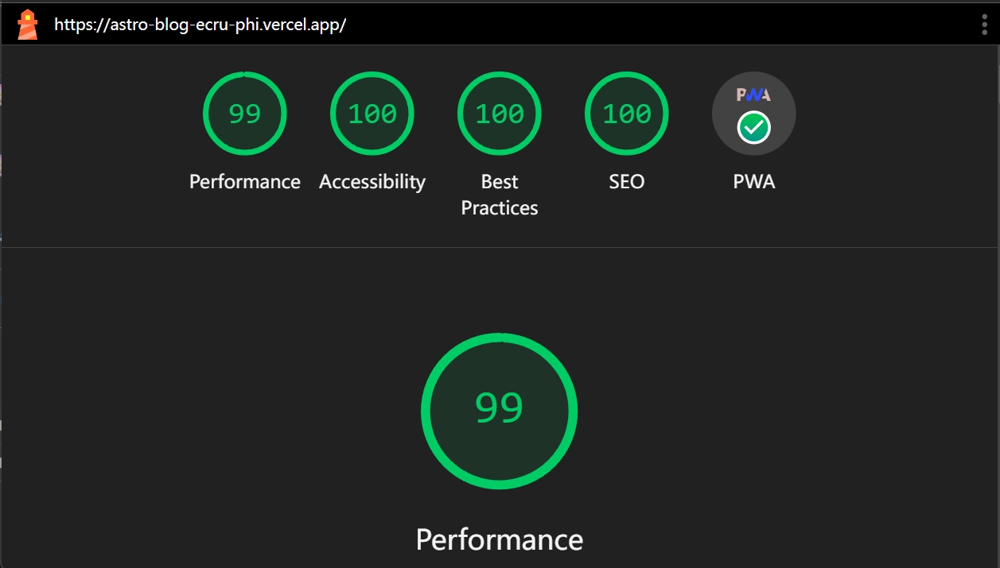

这是一个现代化的博客主题，基于 Astro 框架构建，采用 TailwindCSS 进行样式设计。主题具有简洁的外观、优秀的性能，支持深浅色模式切换、全文搜索、PWA 离线访问等功能，完美适配桌面端和移动端。

#### 使用方法

- 下载安装

  下载或克隆本项目[astro-blog](https://github.com/babybluue/astro-blog)，安装依赖：`yarn install`，确保 Node 版本>=20+。

- 文章目录

  将 Markdown 文件放入 _posts_ 目录，或者 _notes_ 目录，并修改 YAML 头信息 (添加 abbrlink 属性作为文章链接)。

- 基础配置

  _constant.ts_ 文件中存放了一些常用的变量，如网站地址，标题，描述等信息，以及 _public/_ 目录下存放的静态资源包含网站图标，PWA 安装图标信息，可以根据需要改更。

- 本地运行

  `yarn dev`运行项目，访问 http://localhost:4321 即可看到博客页面。

#### 创建文章

`yarn run new --title='关于这个博客主题' --dir=drafts`

你可以运行脚本快速创建一篇文章，以上命令会在 _drafts_ 文件夹下创建一个名为 **2024-11-14-关于这个博客主题.md** 的文件，文件包含基本 YAML 头信息，并且创建一个唯一的属性 abbrlink，博客默认以该标识符作为文章的链接。

#### 文章头信息

```ts {1-3}
title: 关于这个博客主题
date: 2024-11-14T02:59:57.109Z
abbrlink: c3009907
tags:
// [!code ++]
- Astro
// [!code --]
- Theme
- Blog
// [!code warning]
description: '这是一个使用 Astro 框架搭建的博客。'
// [!code error]
cover: '@images/c3009907.png'
```

#### Markdown 特殊样式

A note[^1]

[^1]: Big note.

~one~ or ~~two~~ tildes.

- [x] Eat
- [x] Sleep

> This is a blockquote.  
> hello there

> [!NOTE]
> Useful information that users should know, even when skimming content.

> [!TIP]
> Helpful advice for doing things better or more easily.  
> xxxxxxxxxxxxxxxxx

> [!IMPORTANT]
> Key information users need to know to achieve their goal.

> [!WARNING]
> Urgent info that needs immediate user attention to avoid problems.

> [!CAUTION]
> Advises about risks or negative outcomes of certain actions.


